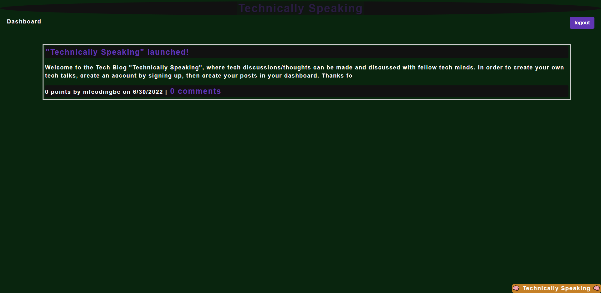

# Technically Speaking: Tech Blog

In order to better understand `handlebars.js` and `MySql`, this blog website was created where people can create an account to comment on mini blog posts from other tech developers.

## Description

This CMS-style blog site allows developers who write about tech to publish articles, blog posts, and their thoughts and opinions on other posts.

## Installation

Check out the Tech Blog Site [Technically Speaking](https://quiet-garden-00258.herokuapp.com/).

## Usage

On the homepage, click on `Login` to further navigate to the `Signup` page where you can create an account. Once you have made the account, you can access your dashboard to create new posts about tech, as well as comment and upvote other blog posts. Any blog post you make can be edited or deleted.

## Technologies Used

- Node.js
- Express.js
- Heroku
- MySql
- Sequelize
- Handlebars.js
- express-session

## Credits

I, [mfcodingbc](https://github.com/mfcodingbc), created the website in its entirity. Any questions can be directed to me.

## License

[MIT](https://choosealicense.com/licenses/mit/)
